# Dungeon Soundboard 1.2.0 — визуальный эталон для Windows

Этот каталог дополняет функциональное ТЗ фактическими кадрами macOS-версии 1.2.0. Эталон снят с `main` на commit `8adf282` в изолированном демонстрационном профиле: реальные настройки и медиатека пользователя не изменялись.

Скриншоты сделаны на Retina. Полный кадр имеет размер `2160 × 1424 px` и показывает окно размером `1080 × 712 pt` вместе с нативной рамкой macOS. При сравнении Windows-версии нативные рамки ОС не сравниваются: эталоном является клиентская область под title bar.

## Как пользоваться эталоном

- Полные кадры задают общую композицию, пропорции панелей, затемнение модальных состояний и взаимное положение элементов.
- Detail-кадры задают плотность, отступы, форму контролов, толщину обводок и визуальные состояния.
- На Windows сохраняется нативный Windows title bar. Внутри окна используется `Segoe UI`, а сочетания переводятся с `Command/Option` на `Ctrl/Alt`.
- Не нужно копировать пиксельные особенности сглаживания SF Pro или AppKit. Нужно воспроизвести геометрию, иерархию, цвет, вес текста и состояния.
- Нельзя добавлять на главный экран отдельные кнопки `Stop Music`, `Stop All`, ducking, выбор темы, inline-редактирование или кнопки перемещения вверх/вниз: их нет в эталоне.

## 1. Главное окно

### Кадр 01 — заполненное окно, Classic Dungeon, русский язык

Что видно:

1. Нативный title bar с названием приложения.
2. Внутренняя верхняя строка: слева `Dungeon Soundboard`, справа единственная кнопка-шестерёнка.
3. Sidebar разделён на музыкальные и SFX-плейлисты. В каждой секции есть заголовок и кнопка `+`.
4. Центральная часть разделена горизонтальным splitter на Music и SFX. Узкая светлая capsule внутри широкой hit-area показывает, что границу можно перетаскивать.
5. В заголовке каждой центральной зоны слева стоит название выбранного плейлиста, справа — `Добавить файлы` и `Добавить папку`. `Удалить выбранные` появляется только при непустом multiselection.
6. Карточки расположены в равной трёхколоночной сетке. Название занимает одну строку и обрезается многоточием. Корзина постоянно видна справа.
7. У текущей музыкальной карточки фон светлее, есть слабая акцентная рамка и круглая иконка pause. Badge `A` показывает индивидуальный хоткей.
8. Внизу находится единая player bar на всю ширину. Слева отображаются текущий трек и playback-плейлист, справа — shuffle, repeat и `Остановить SFX`. Ниже — транспорт, seek, время и два master-volume.

Ключевой layout-контракт:

- внешний отступ `12 DIP`, основной gap `10 DIP`;
- sidebar: minimum `250`, preferred `270`, maximum `300 DIP`;
- minimum центральной области `560 DIP`;
- music sidebar стартует примерно с `220 DIP`, music content — с `260 DIP`;
- minimum высоты обеих половин sidebar `96 DIP`, content `120 DIP`;
- splitter имеет hit-area `10 DIP`, видимая capsule `42 × 4 DIP`;
- нижняя player bar не прокручивается и всегда остаётся на месте.

### Кадр 02 — hover музыкального плейлиста

На hover справа от названия музыкального плейлиста появляются три элемента:

- Shuffle Play — выбирает этот плейлист, включает shuffle и сразу запускает случайный трек;
- drag handle — переносит строку внутри списка музыкальных плейлистов;
- шестерёнка с menu indicator — открывает Rename/Delete.

Элементы появляются внутри существующей строки и не меняют её высоту или ширину, поэтому соседние строки не должны прыгать. У SFX-плейлиста Shuffle Play отсутствует: остаются только drag handle и шестерёнка.

### Кадр 10 — выбранный плейлист и независимый playback-контекст

Этот кадр фиксирует важное разделение состояний: выбранный sidebar-плейлист определяет содержимое центральной панели, а подпись в player bar показывает playlist, из которого был запущен текущий трек. Выбор строки sidebar сам по себе не останавливает и не переключает музыку.

### Кадр 11 — current card, selected card, hover controls и tooltip

На кадре одновременно видны:

- selected music card — акцентная рамка;
- current music card — более тёплый фон и иконка pause;
- hotkey badges `A` и `Shift+S`;
- hover SFX-card — drag handle и шестерёнка появляются перед корзиной;
- системный tooltip с полным фактическим путём файла.

Hover-контролы не должны сдвигать текст карточки. Tooltip нужен для обеих ролей, потому что видимое имя может быть переименовано и не совпадать с именем файла.

### Кадр 18 — hover-контролы карточки

На второй музыкальной карточке видны drag handle, шестерёнка с indicator и корзина. Drag handle имеет визуальный размер около `18 × 18 DIP`. Drag выбранной карточки переносит весь multiselection; drag невыбранной — только её.

### Кадр 17 — меню Repeat

Picker в player bar содержит ровно три значения:

1. `Без повтора`;
2. `Повтор трека`;
3. `Повтор плейлиста`.

На Windows допустим нативный выпадающий список Avalonia/Windows, но его ширина, тёмная поверхность, selection color и расположение должны соответствовать этому кадру. Меню не должно расширять player bar.

## 2. Карточка: меню, громкость и диалоги

### Кадр 12 — контекстное меню трека

Правый клик открывает меню в следующем порядке:

1. `Воспроизвести`;
2. `Переименовать`;
3. `Громкость`;
4. `Назначить бинд` или `Изменить бинд`;
5. `Очистить`, только если бинд существует;
6. `Удалить`.

Меню использует тёмную поверхность, тонкую светлую обводку, radius около `12 DIP` и системную тень. Контекстное меню не заменяется рядом постоянно видимых кнопок.

### Кадр 13 — popover индивидуальной громкости

Popover привязан к карточке и имеет ширину около `270 DIP`. Содержимое:

- заголовок `Громкость`;
- вторичная строка `Трек · Плейлист`;
- slider `0–200%`;
- числовой процент;
- кнопка `Сбросить на 100%`.

Изменение громкости текущего музыкального трека слышно сразу. Для SFX новое значение применяется при следующем запуске эффекта.

### Кадр 14 — Rename sheet

Модальное состояние затемняет всё основное окно. Диалог располагается по центру и содержит prefilled TextBox, `Отмена` и акцентную `Сохранить`. Ориентир ширины — `360 DIP`, padding — `20 DIP`. Enter подтверждает, пустое после trim значение запрещает сохранение. Переименовывается только отображаемое имя; файл на диске не меняется.

### Кадр 15 — захват хоткея

Capture overlay показывает:

- `Нажмите комбинацию`;
- объект назначения в формате `Трек · Плейлист`;
- подсказку о допустимых обычных клавишах, `Shift+` и `Ctrl+`;
- кнопку `Отмена`.

Ориентир ширины — `340 DIP`, radius `12 DIP`, выраженная мягкая тень. Escape отменяет. `Alt`, Windows key, `Shift+Ctrl` и Tab не принимаются. Хоткеи app-local и работают только при активном окне.

## 3. Настройки

Настройки — модальный overlay внутри главного окна, а не отдельное taskbar-окно. Фон затемняется. Minimum size модальной панели `660 × 560 DIP`. При каждом открытии активна вкладка `Звук`. Изменения применяются и сохраняются сразу; кнопка `Готово` только закрывает overlay.

### Кадр 03 — вкладка «Звук»

Внутри одной полупрозрачной section-card находятся:

- Ducking `20–100%`, default `55%`;
- `Колонки треков`: `2 / 3 / 4`, default `3`;
- `Колонки эффектов`: `2 / 3 / 4`, default `3`;
- `Плавно затихать при паузе музыки`, default Off.

Section-card: padding около `14 DIP`, внутренний gap около `10 DIP`. Сегментированные контролы и sliders используют accent только для активной части.

### Кадр 04 — «Графический интерфейс», верх

Порядок секций строго фиксирован:

1. пресеты;
2. цвета;
3. фон;
4. интерфейс;
5. reset.

В верхней части видны selector готового пресета, TextBox имени собственного пресета и disabled-кнопка `Сохранить`. Ниже размещены десять alpha-aware color pickers в две колонки: два background, две surface, card, current card, accent, primary/secondary text и danger.

### Кадр 05 — «Графический интерфейс», низ

Кадр фиксирует нижнюю часть настроек фона и chrome:

- opacity изображения;
- затемняющий слой;
- blur;
- плотность Compact/Normal/Spacious;
- материал Low/Medium/High;
- radius `8–24`;
- panel opacity `55–98%`;
- accent intensity `0–100%`;
- две разные reset-команды.

Scroll меняет только содержимое вкладки. Верхняя панель tabs и нижняя строка с `Готово` остаются закреплены.

### Кадр 06 — «Хоткеи», системные действия

Каждая строка имеет название действия, текущую комбинацию вторичным текстом и справа `Назначить/Изменить` плюс `Очистить`. Строки разделены тонкими divider. Полный набор:

- остановить SFX — `Delete`;
- остановить все звуки — не назначен;
- пауза/воспроизведение — `Space`;
- громкость музыки `+` и `−`;
- громкость SFX `Shift++` и `Shift+-`.

Шаг изменения master-volume — `5%`.

### Кадр 07 — «Хоткеи», назначенные треки и эффекты

Ниже системных действий находится секция `Назначенные треки и эффекты`. Элементы сортируются по строке `Трек · Плейлист`; сочетание отображается отдельной вторичной строкой. Справа доступны `Изменить` и `Очистить`. Кнопка возврата к defaults также удаляет индивидуальные бинды.

### Кадр 08 — «Система»

Вкладка содержит три секции:

- язык: только `English` и `Русский`, переключение применяется сразу;
- телеметрия: toggle Sentry и disabled DSN-поле при Off;
- About: `Made by MWell on github` и версия `1.2.0`, прочитанная из bundle/assembly metadata.

Локальный error log ведётся независимо от Sentry. DSN активируется только при включённом toggle.

## 4. Увеличенные детали

Эти кадры являются crop исходных скриншотов без перерисовки и без AI-генерации.

### Sidebar и splitters

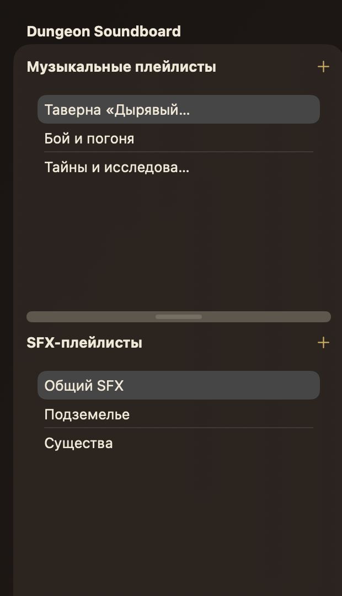

Sidebar — одна полупрозрачная панель с двумя списками. Выбранная строка использует нейтральный светлый selection fill; accent не применяется к обычному sidebar selection. Между секциями находится интерактивный splitter. Названия длинных плейлистов обрезаются одной строкой.

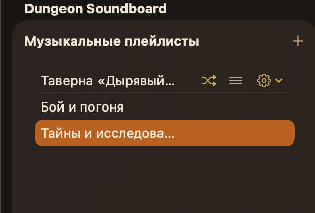

На hover кнопки аккуратно занимают правую часть строки. Название получает меньшую доступную ширину и ellipsis, но высота строки остаётся прежней.

### Music и SFX grids

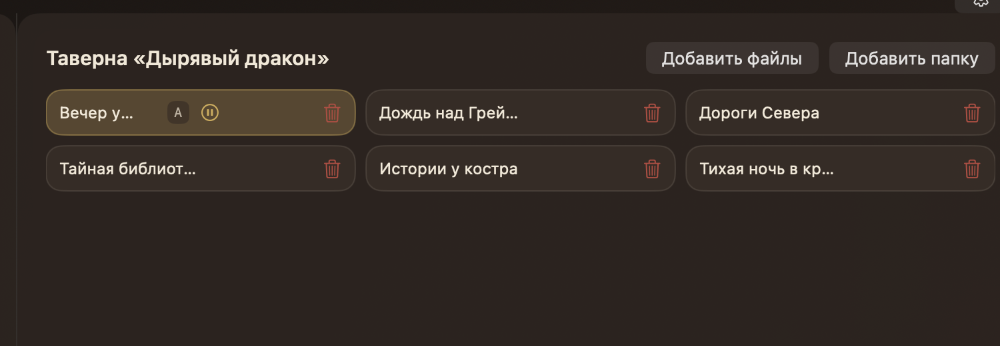

Music grid: gap `8 DIP`, card radius `12 DIP`, outline `1 DIP`. Заголовок и кнопки находятся вне scrollable grid. Вся свободная поверхность ниже header — drop-target, а не только область карточек.

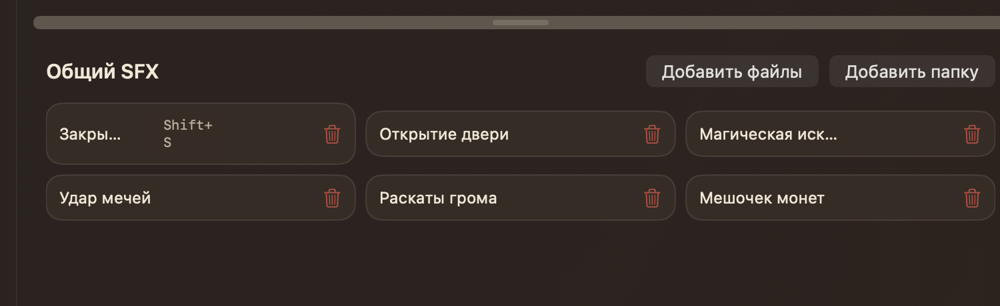

SFX grid повторяет геометрию Music. Отличается только поведением playback: каждое нажатие создаёт отдельную voice, параллельные SFX допустимы.

### Player bar

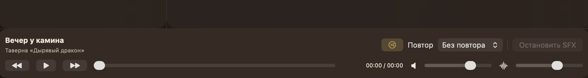

Первая строка слева содержит title и playback playlist, справа — shuffle, Repeat picker, divider и Stop SFX. Вторая строка: Previous, Play/Pause, Next, seek slider, `MM:SS / MM:SS`, music icon/volume и SFX icon/volume. Время использует monospaced digits и фиксированную ширину около `110 DIP`.

### Меню и overlays

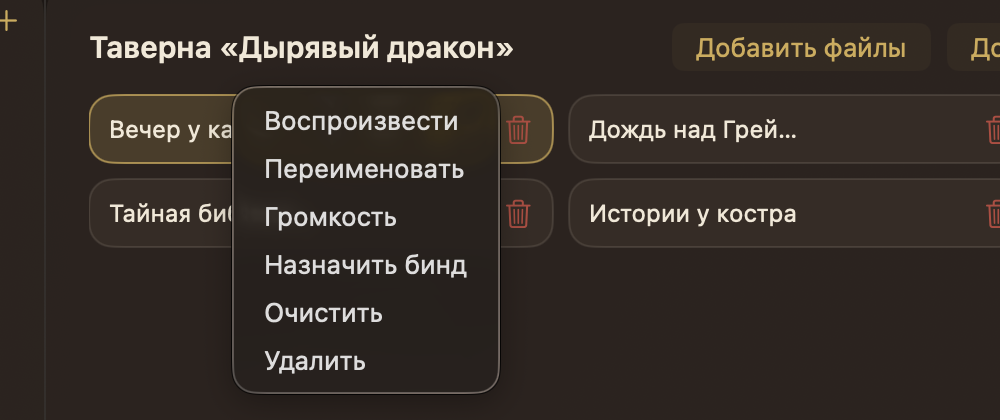

Контекстное меню сохраняет одинаковую высоту пунктов и не содержит иконок.

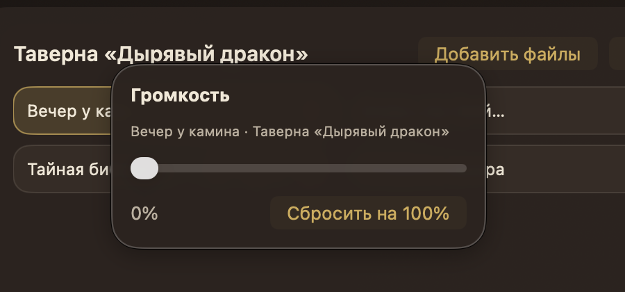

Popover не затемняет всё окно: затемнение на кадре создаётся самой поверхностью popover и его тенью. Slider занимает почти полную ширину.

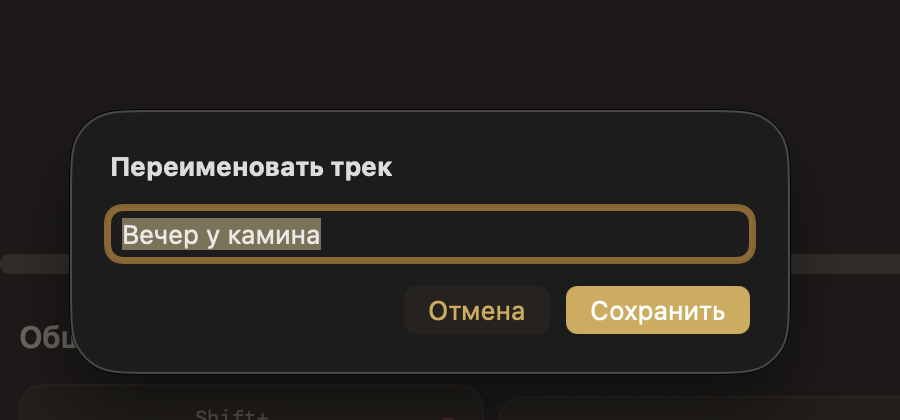

Focus ring TextBox использует accent; primary action залит accent, cancel остаётся тёмной кнопкой с accent-текстом.

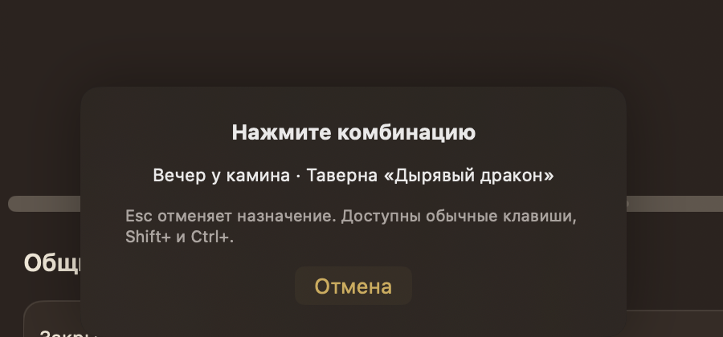

Capture overlay намеренно минимален: никакого списка клавиш или отдельного поля ввода нет.

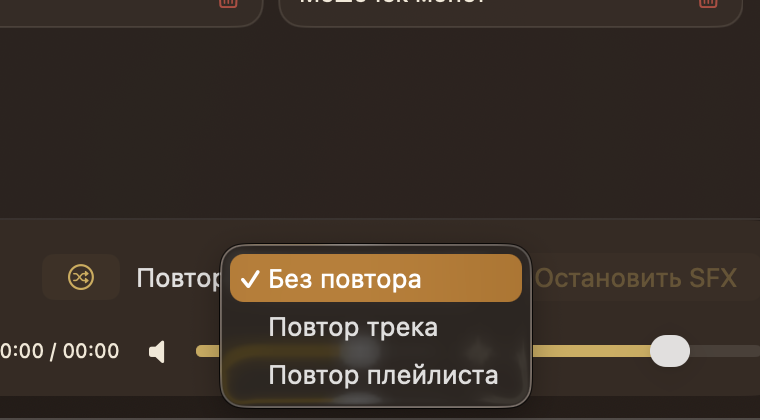

Текущее значение помечается checkmark и accent fill. Остальные пункты остаются на тёмной поверхности.

### Settings крупно

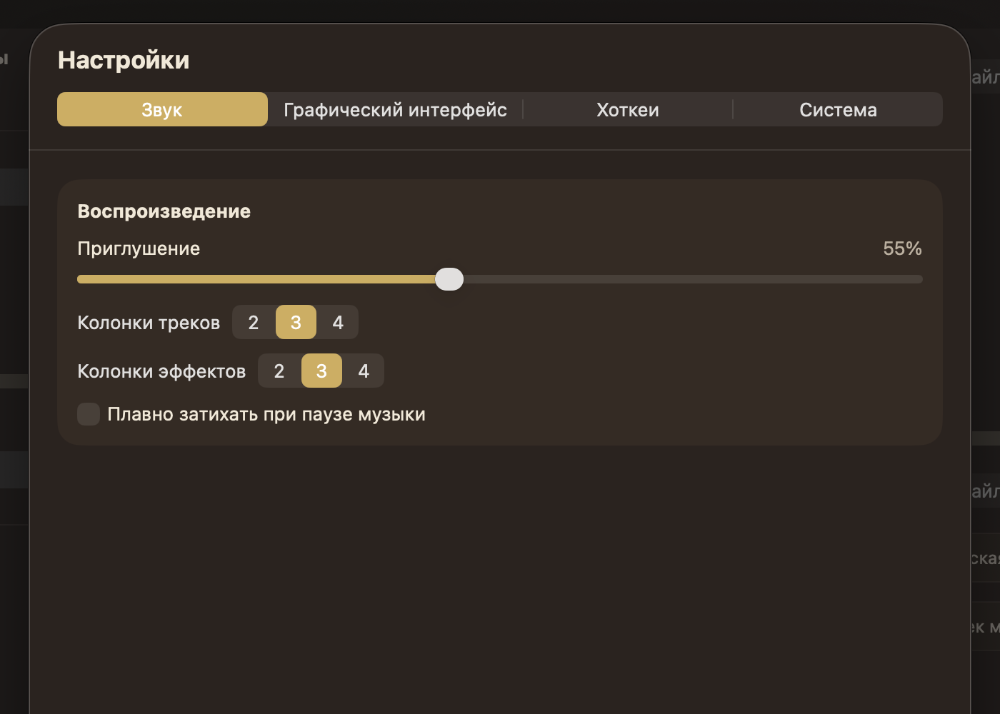

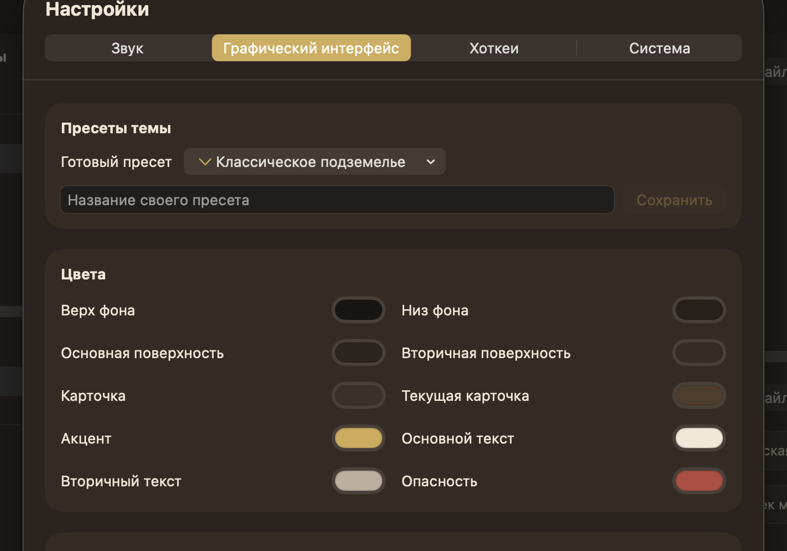

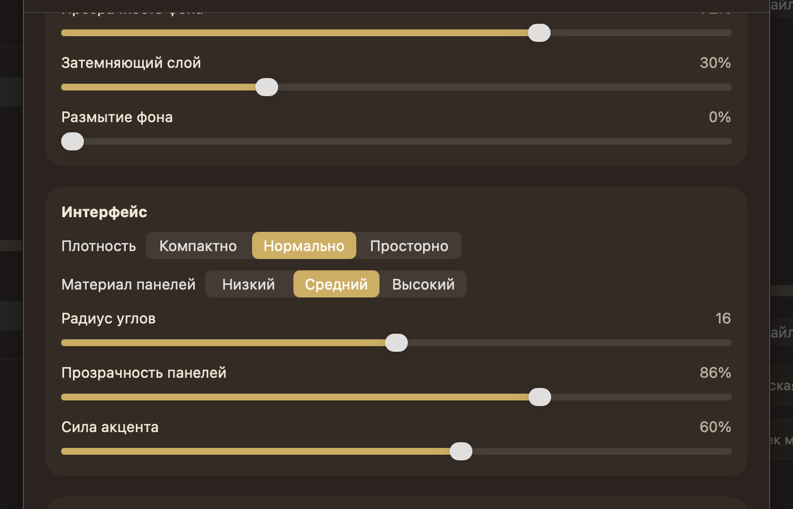

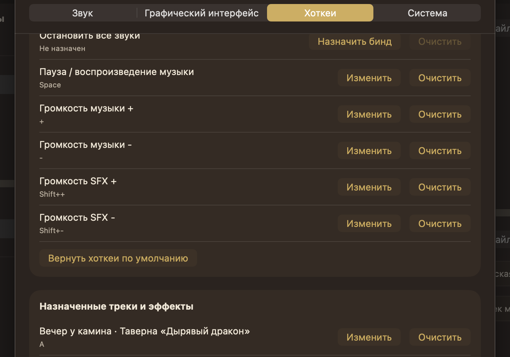

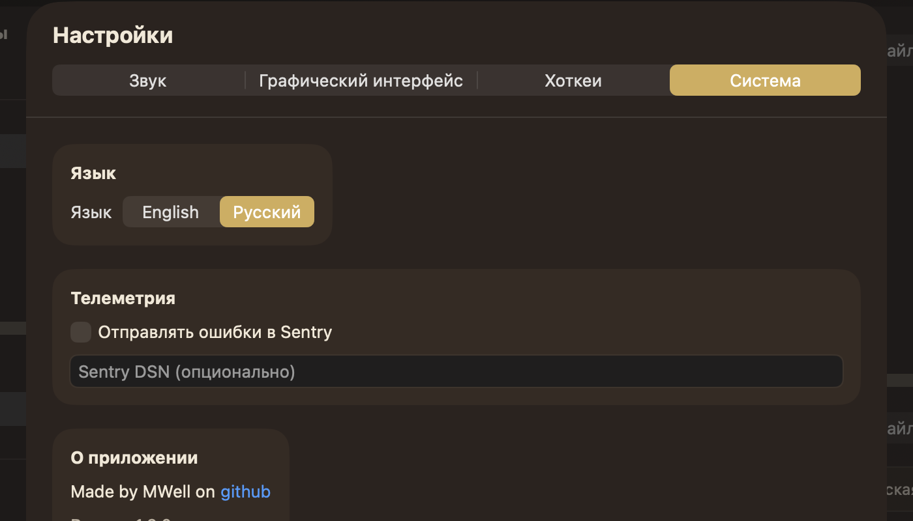

Во всех вкладках сохраняются одинаковые tabs, section-card radius, внутренние отступы, цвет divider и ширина контента. Нельзя заменять settings на стандартную белую Windows-форму.

## 5. Цветовой и геометрический контракт

### Classic Dungeon

| Токен | Значение |
|---|---:|
| Background top | `#1A1412` |
| Background bottom | `#291F1A` |
| Surface primary | `#2E241F` |
| Surface secondary | `#382B24` |
| Card | `#3D3029` |
| Current card | `#523D2B` |
| Accent | `#D1AB52` |
| Danger | `#B8473D` |
| Text primary | `#F2E8D6` |
| Text secondary | `#BDB09E` |

Параметры default: panel opacity `86%`, corner radius `16`, material `Medium`, accent intensity `60%`, background image opacity `72%`, dim overlay `30%`, density `Normal`.

Вычисляемые состояния:

- `accentSoft` — смесь primary surface и accent с долей `0.20 + 0.35 × accentIntensity`;
- current card — добавление accent с долей `0.10 + 0.22 × accentIntensity`, затем смешивание со stored current-card на `45%`;
- divider — secondary text с alpha `0.24 + 0.20 × accentIntensity`;
- минимальный contrast ratio primary/secondary text — `4.5 / 3.2`.

### Плотность

| Density | Padding | Spacing | Row | Control width | Radius multiplier |
|---|---:|---:|---:|---:|---:|
| Compact | 10 | 8 | 30 | 108 | 0.90 |
| Normal | 12 | 10 | 34 | 120 | 1.00 |
| Spacious | 16 | 14 | 40 | 132 | 1.08 |

## 6. Drag-and-drop: визуальные состояния и зона приёма

Статический кадр не может полностью показать жест drag, поэтому эта секция является обязательным дополнением к изображениям.

### Центральные панели

Drop-target — вся внутренняя площадь Music/SFX-панели от области под header до нижней границы панели, включая пространство справа и снизу от grid. Размер drop-zone не зависит от количества карточек. Именно это предотвращает прежнюю ошибку, когда файл принимался только узкой полосой вокруг содержимого.

При допустимом drag:

- панель получает акцентную outline `2 DIP` по своей полной границе;
- свободное пространство остаётся подсвеченным и принимает drop;
- layout не меняется и placeholder не добавляется;
- недопустимая роль не подсвечивается: music принимается только Music, SFX — только SFX.

### Строки плейлистов

Playlist row принимает:

- reorder плейлистов той же роли;
- внутренний payload треков/эффектов подходящей роли;
- файлы и папки Explorer.

При валидном drag строка получает accent outline `2 DIP`, сохраняя текущий fill. Drop из Explorer импортирует прямо в target playlist и не меняет sidebar selection.

### Карточки

- Drag выбранной карточки переносит весь multiselection в порядке source playlist.
- Drag невыбранной карточки переносит только её.
- Внутри playlist drop относительно карточки вставляет группу перед target; drop в свободное место — в конец grid.
- Между playlists default — Move; на Windows `Alt+Drag` — Copy.
- Move сохраняет UUID, metadata, playback и voice; Copy создаёт новые UUID и не копирует hotkeys.
- Модель меняется один раз на Drop. `DragOver/DragEntered` меняют только временную подсветку.

## 7. Состояния, которые нужно проверить на Windows вручную

Скриншоты задают визуал, а нижеследующая матрица предотвращает расхождения в интерактивных состояниях:

- окно `1220 × 780 @100%`, `1536 × 960 @125%`, minimum `1080 × 680 @100%`;
- normal, hover, selected, current и drop-target для карточки;
- normal, hover, selected и drop-target для playlist row;
- пустые Music/SFX-плейлисты с полноразмерной drop-zone;
- открытый Repeat picker, context menu, volume popover, Rename, Delete confirmation, hotkey capture/conflict;
- все четыре Settings tabs в верхней и нижней позиции scroll;
- English и Русский без обрезания подписей;
- Classic Dungeon, Tavern Ember, Moonlit Crypt, Forest Mist и custom theme/background;
- Explorer file/folder drop, внутренний group Move, `Alt`-Copy и reorder;
- current music и активный SFX во время переноса.

Допустимое отклонение геометрии клиентской области — не более `2 DIP`. Не допускаются перекрытия, прыжки layout на hover, лишние постоянные контролы или уменьшение drop-zone до размеров grid.

## 8. Иконка приложения

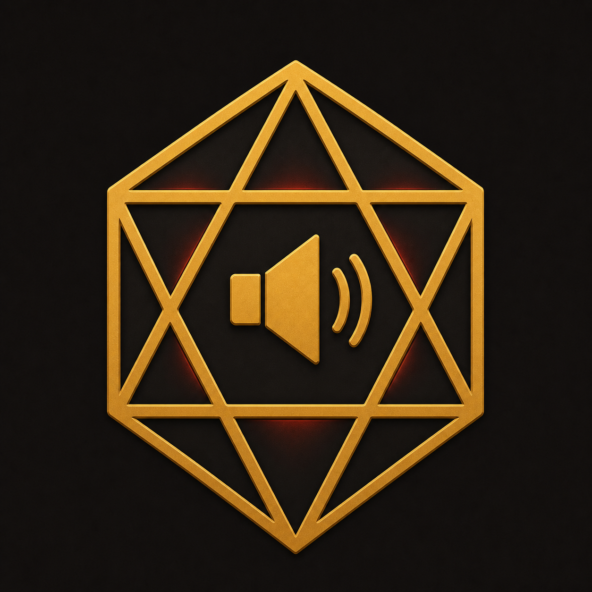

Для Windows нужно сохранить исходную композицию, цвета и узнаваемость иконки, подготовив корректный multi-size `.ico`. Скруглённая macOS-маска не должна повторно запекаться внутрь дополнительной Windows-плашки.
